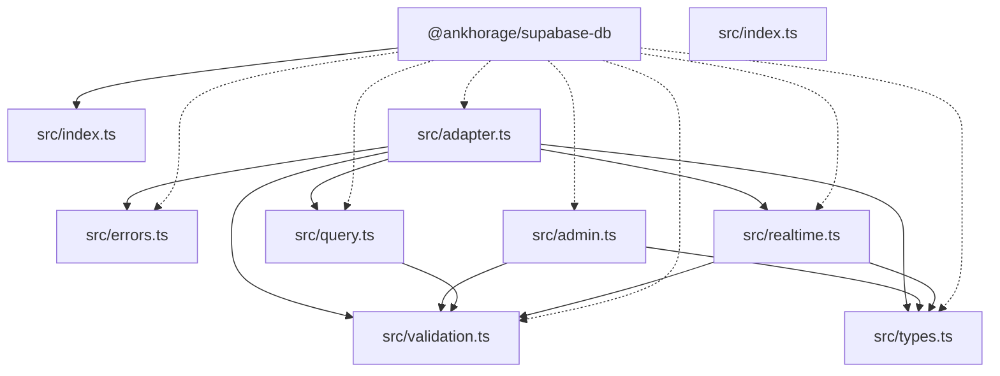

<!-- markdownlint-disable MD013 MD033 -->
<!-- This file is generated by Paradox. Do not edit manually. -->

# @ankhorage/supabase-db

        

Provider-neutral Supabase database adapter exposing typed CRUD, schema management, and realtime subscriptions.

## Generated documentation

- [Interactive documentation app](././paradox/index.html)
- [Public API reference](././paradox/exports.md)
- [Component registry](././paradox/components.md)
- [Architecture overview](././paradox/diagrams/architecture-overview.mmd)
- [Module relationships](././paradox/diagrams/module-relationships.mmd)
- [Export graph](././paradox/diagrams/export-graph.mmd)
- [createSupabaseDbAdapter sequence](././paradox/diagrams/sequences/create-supabase-db-adapter.mmd)
- [createSupabaseDbAdminAdapter sequence](././paradox/diagrams/sequences/create-supabase-db-admin-adapter.mmd)
- [normalizeRealtimeEvent sequence](././paradox/diagrams/sequences/normalize-realtime-event.mmd)

## Architecture preview

Architecture overview

